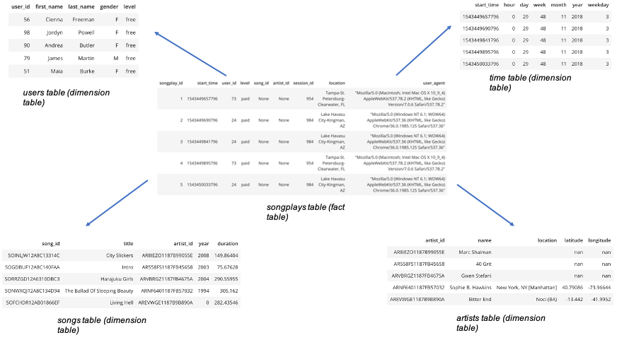

# Description of the use case

Sparkify is a startup which owns a music streaming app, and the company sees its user base growing significantly, that's why they want to automate more their processes with Spark.
More precisely, the startup has log files and songs data stored in s3, and wants to use Spark to process these files to create 4 dimension tables and 1 fact table, 
and save them into parquet files. This will help them to analyze the user data more quickly.

# Description of the database schema design and ETL pipeline

The database is designed in a star schema, which means that we have one main fact table (the songplays table) and 4 dimensions tables (users, songs, artists and time). This design is opted here because with this design, we don't need to do complicated queries to have the information we need. 

More precisely, we can quickly query the most important and interesting information on the fact table itself (without any join), and if we want some more precisions, we can join with the corresponding dimension tables to have that information (as we have 4 dimension tables, with 4 joins we can access all the available information).

Here is an illustration of the tables and the star schema : 



Regarding the ETL pipeline, we are extracting information stored in json files in S3 with spark, processing them to extract the dimension tables end the fact table,
and storing these newly created tables back in s3.

# How to run the ETL pipeline ?

To run the ETL pipeline, open a terminal and change the directory to this directory.
Once you're here, run the following command :

```bash
python etl.py
```

This script will first create the SparkSession, then load and process the json logs and songs data stored in s3
to create the four dimension tables and the fact table, and save then in parquet file in s3.

# Detailed files description

**etl.py** : python script which will first create the SparkSession, then load and process the json logs and songs data stored in s3
to create the four dimension tables and the fact table, and save then in parquet file in s3.

**dl.cfg** : file containing the aws credentials to read data and save data from S3. However, this file is empty here as we should not share the AWS credentials.
